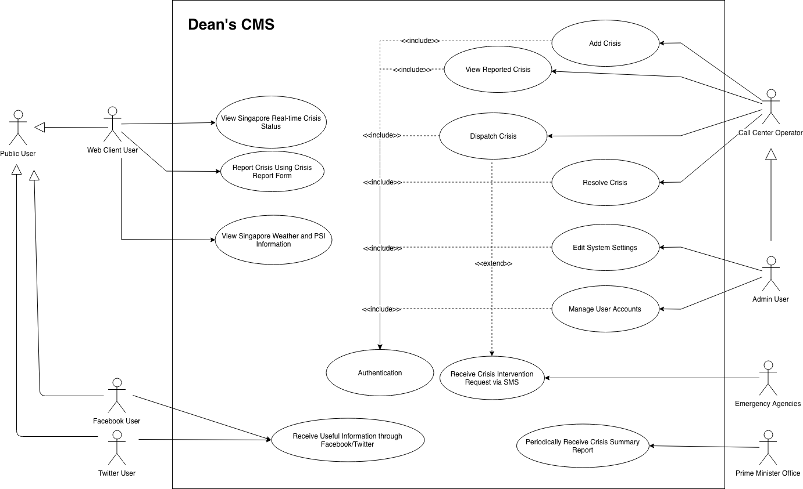
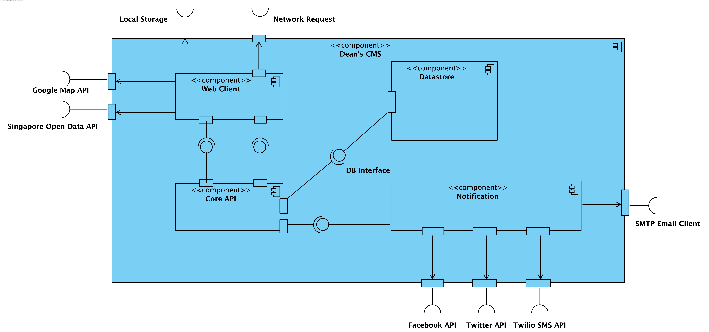
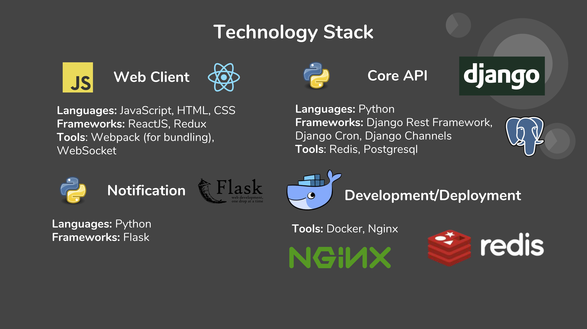
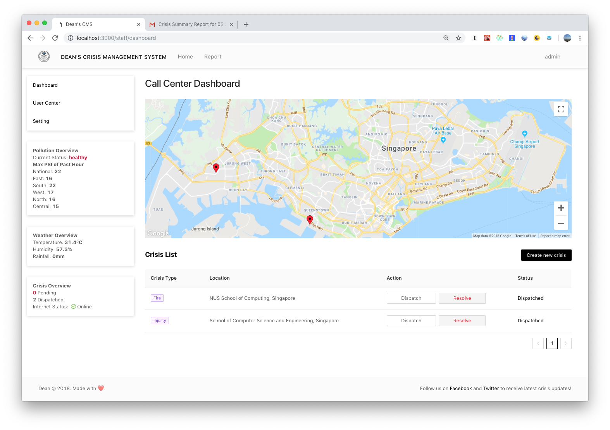
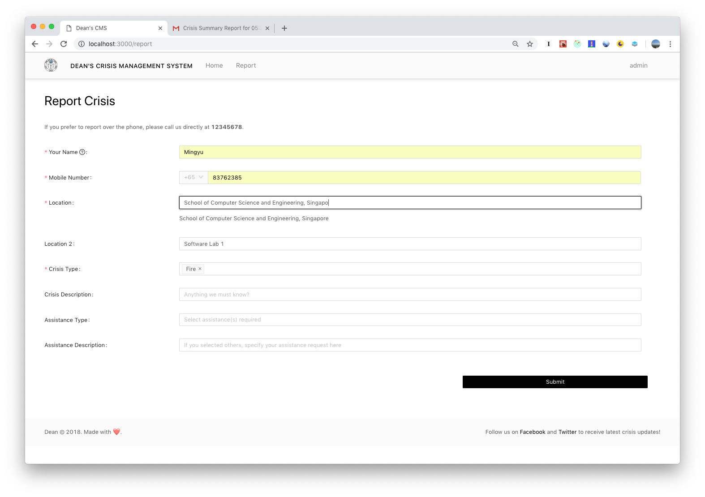

# Dean's Crisis Management System

The Ministry of Home Affairs (MHA) is procuring a Crisis Management System (CMS) to allow seamless collaboration between government agencies in times of emergency. The Prime Minister, cabinet ministers and government agency key decision makers shall monitor the crisis situation through the CMS.

## Use Cases



## Software Architecture (Highest Level)

**3 Tier Architectural Style** is adopted for this system.
Presentation Tier: Web Client
Application Tier: Core API, Notification
Datastore Tier: Datastore



## Key Technologies



#### Web Client

Web Client System is the Graphical User Interface of the Crisis Management System and the entry point for users. It is built with JavaScript, HTML and CSS using ReactJS framework and Redux as state manager.

#### Core API

Core API System handles all requests between Web Client and Notification. It provides RESTful API endpoints and is built with Python using Django Rest Framework. Django Channels and Redis are used to implement WebSocket to achieve duplex communication with Web Client System. To schedule periodic task such as sending crisis summary report, Core API makes use of Django Cron. All persistence data are stored in a Postgresql database.

#### Notification

Notification handles requests from Core API and dispatch notifications accordingly. It is built on Python-Flask and integrated with Facebook API, Twitter API, SMTP Email Client and Twilio SMS API.

## Peek




## How to Run

For easy development environment setup, Docker is used throughout the development. To run the system, please follow the instructions:

1. Install `Docker` and `Yarn` on your computer.
2. Go to project root directory and type the following command in terminal: ```docker-compose up --build```. This will launch the Core API System and Notification System.
3. Go to `/deans-frontend` directory and type the following commands in terminal: ```yarn install```, ```yarn start```. This will launch the Web Client System.
4. Go to `localhost:8000` and start exploring!
